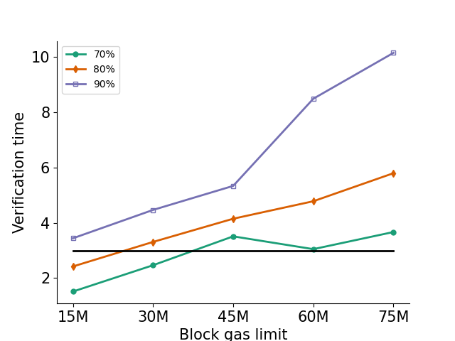

# REP-0025: Change the block gas limit to 30,000,000 

## Preamble
<pre>
REP-0025
Title: Change the block gas limit to 30,000,000 
Author: Ronin Core Team
Type: Standard Track
Status: Executed
Created: 2025-01-02
</pre>

## Abstract

This proposal specifies to change the block gas limit to 30,000,000 gas. 

## Rationale

As the Ronin Network continues to expand, the demands placed on validator nodes are increasing. With higher transaction volumes and complex smart contract interactions, validators face significant challenges in maintaining the network's performance. Currently, the block gas limit is set at 100,000,000 gas, allowing for a large number of transactions to be processed within a single block. However, this high gas limit presents potential issues, particularly under the network's 3-second block time. When transactions involving heavy computations, such as batch Axie transfers, are included in a block, the time required for nodes to verify that block increases substantially. If the verification process exceeds the 3-second block time, it can disrupt the normal flow of block production, leading to slower block times and potential delays in transaction finality. This can affect user experience and the overall reliability of the network.

To better understand the impact of block gas limits on node performance, we conducted benchmarking tests. These tests focused exclusively on blocks containing batch Axie transfers, a known example of resource-intensive transactions. The validator nodes used in the tests met the hardware requirements outlined in [validator setup guide](https://docs.roninchain.com/validators/setup/overview).

Our benchmarking measured the time it takes for 70%, 80%, and 90% of nodes to successfully verify a block at different gas limits. These tests provided valuable insights into the relationship between block gas limits and network performance. As the gas limit increases, the time required for nodes to verify blocks rises, creating a bottleneck that makes it increasingly difficult to meet the 3-second block time.

Based on the results, with 30,000,000 gas in a block, 70% of nodes can verify the block in 2.5 seconds. Thus, we propose reducing the block gas limit from 100,000,000 gas to 30,000,000 gas. This adjustment would significantly lower the computational load on validator nodes, ensuring that blocks can be verified within the required time frame even when resource-intensive transactions are included. 

## Specification

- Go to docker directory
`cd /root/ronin/docker`
- Update .env file by changing the parameter in ronin-params from `--miner.gaslimit 100000000` to `--miner.gaslimit 30000000`
- Restart docker-compose
`docker-compose up -d` 

## Security analysis

This does not affect the security of Ronin.

## License

The content is licensed under [CC0](https://creativecommons.org/publicdomain/zero/1.0/).
